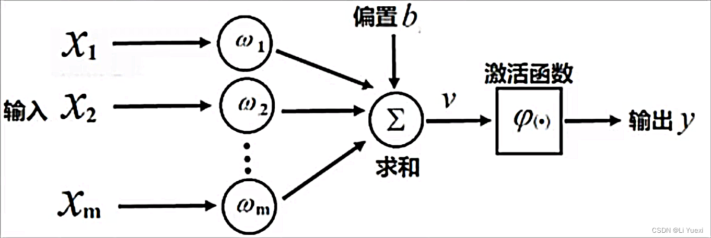
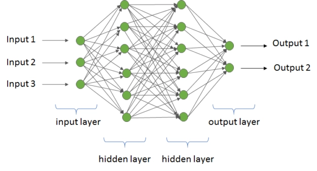
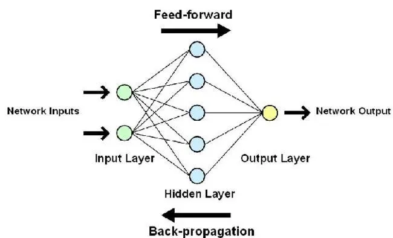
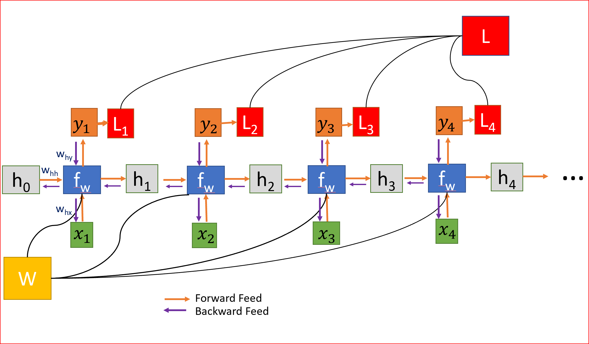
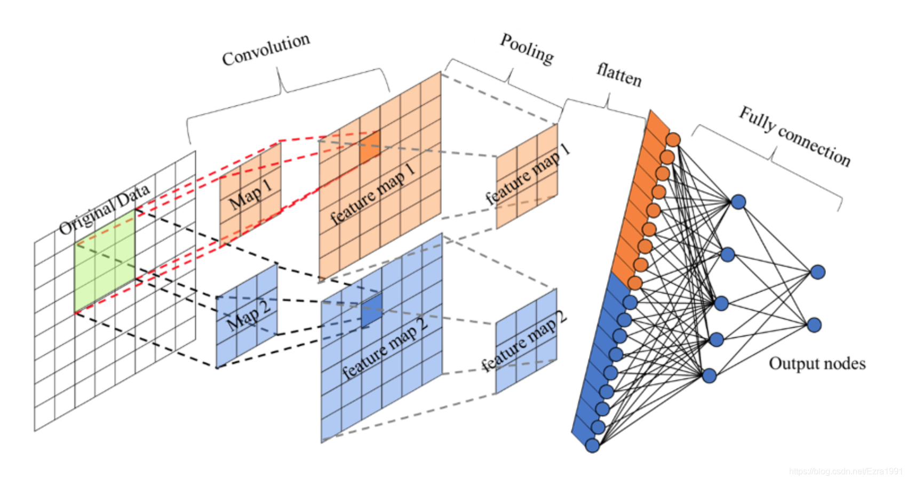
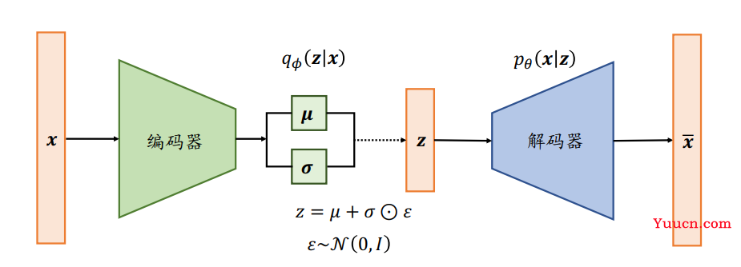
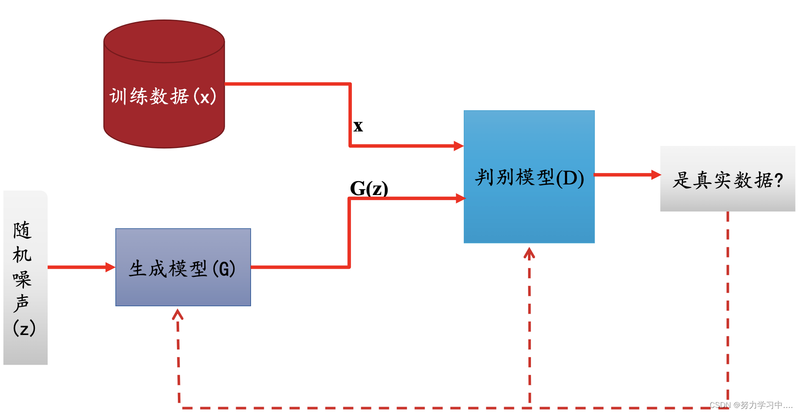

# 深度学习简介

## 简介

深度学习的概念由Hinton等人于2006年提出。深度学习的概念源于人工神经网络的研究。在学习传统机器学习的时候，有一个算法叫做感知机，它其实是一个简单的人工神经元，而含有多隐层的多层感知机就是一种深度学习结构。深度学习通过组合低层特征形成更加抽象的高层次表示属性类别或特征，以发现数据分布式特征表示。

## 关系

刚刚接触AI很容易被各种概念混淆，深度学习其实是属于机器学习的一个分支，同时机器学习又是人工智能的一个子集。但事实上现在提到机器学习，大多时候都是指传统的机器学习。

## 常用开源框架

### PyTorch

**PyTorch** 的前身是Torch，Torch是一个科学计算框架，支持机器学习算法，易用且提供高效的算法实现。Python本身就是一种功能强大而完善的通用类语言，拥有着脚本语言中最丰富的类库。PyTorch支持动态图创建，支持GPU的Tensor库，以便加速计算。

### TensorFlow

**TensorFlow** 是谷歌的第二代机器学习系统，内建深度学习的扩展支持，任何能够用计算流图形来表达的计算，都可用TensorFlow。任何基于梯度的机器学习算法都能够受益于TensorFlow的自动化。

### Caffe
**Caffe** 是一个清晰，高效的深度学习框架，它的核心语言是C++，它支持命令行、Python和MATLAB的接口，它既可以在CPU上运行，也可以在GPU上运行。

## 常用名词

### 人工神经网络(ANNs)

**人工神经网络(Artificial Neural Networks)** 是一种模仿动物神经网络行为特征，进行分布式并行信息处理的算法数学模型。这种网络依靠系统的复杂程度，通过调整内部大量节点之间的相互连接关系，从而达到信息处理的目的，并且有自学习和自适应能力。

### 生物神经元

神经系统得基本结构和功能单位是神经细胞，即**神经元(Neurons)**。1943年发表了神经元的MP模型(如下图)，这是一个包含输入、输出与计算功能的模型。

### 多层感知机

感知机(Perceptron)是一个简单的线性二进制分类器，而一个**多层感知机(MLP)** (如下图)由几个含有全邻接层的感知机组成，形成一个简单的前馈神经网络。

### 前馈神经网络

**前馈神经网络(Feedforward Neural Network)**（如下图），简称前馈网络，在这种神经网络中，各神经元从输入层开始，接收前一级输入，并输入到下一级，直至输出层。整个神经网络中无反馈，可以用一个有向无环图表示。感知机就是一种前馈神经网络，常见的前馈神经网络还有BP神经网络(Back Propagation)和RBF径向基网络(Radial Basis Function)等。

### 循环神经网络

与前馈神经网络不通过，**循环神经网络(Recurrent Neural Network, RNN)** （图下图）的连接构成有向循环。这种双向流动允许使用允许内部时间状态表示，继而允许序列处理。并且值得注意的是，它提供了用于识别语音和手写的必要能力。

### 卷积神经网络

**卷积神经网络(Convolutional Neural Network,CNN)**(如下图) 是一种特殊的深层神经网络模型，也是一种前馈神经网络，它的神经元可以相应一部分覆盖范围内的周围神经元，对大型图像处理有出色的表现。

### 自编码模型

**自编码模型(Auto-Encoder)**(如下图) 是一种无监督学习算法，使用了反向传播算法，让目标值等于输入值。基本的AE可视为一个三层神经网络结构：一个输入层、一个隐藏层和一个输出层，其中输出层和输入层具有相同规模。

### 生成对抗网络
**生成对抗网络(Generative Adversarial Networks,GAN)**(如下图)，GAN模型中的两位博弈方分别由生成式模型(Generative Model)和判别式模型(Discrinative Model)充当。生成式模型G捕获样本数据的分布，用服从某一分布(均匀分布，高斯分布)的噪声Z生成一个类似真实训练数据的样本，追求效果越像真实样本越好；判别模型D是一个二分类器，估计一个数据来自训练数据(而非生成数据)的概率。
