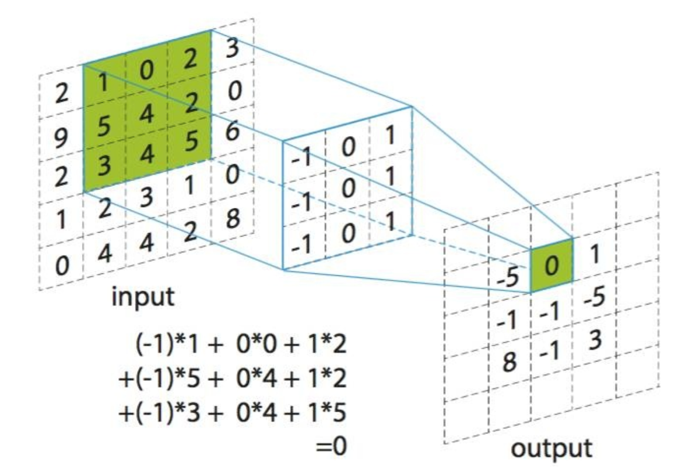
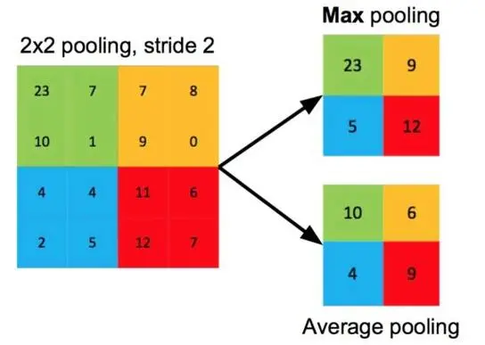

# 卷积神经网络
## 工作基本流程
1. 输入图像到输入层
2. 第一个卷积层的输入图像通过三个可训练的卷积核加偏置进行卷积操作，得到了三个特征图
3. 第一个卷积层之后，池化层对三个特征图进行了下采样，得到三个更小的特征图
4. 第二个卷积层，每个卷积核Fitler都把前面下采样之后的特征图卷积在一起，得到一个新的特征图，然后得到五个特征图
5. 第二个池化层，对5个特征图进行下采样，得到了5个更小的特征图
6. 卷积神经网络的最后两层是全连接层。这些像素数值连接成一个向量输入到传统的神经网络中，得到输出
## 卷积层
**卷积**是分析数学中一种很重要的运算，可以通过两个函数f和g生成第三个函数，其本质是一种特殊的积分变换，表征函数f与g经过翻转和平移的重叠部分函数值乘积对重叠长度的积分。卷积的表达式有连续和离散两种：$（f*g）(n)=\int_{-\infty}^{\infty}f(x)g(n-x)dx,（f*g）(n)=\Sigma_{-\infty}^{\infty}f(x)g(n-x)$。 从参数上看g的参数是f的参数翻转再平移n，可以理解为把g从右边“卷”到左边，再把函数对应点相乘。

在图像上，对图像用一个卷积核进行卷积运算，实际上是一个滤波过程，卷积实际上是提供了一个权重模板，这个模板在图像上滑动，并将中心依次与图像中的每一个像素点对齐，然后对这个模板所覆盖的所有像素进行加权，并将结果作为这个卷积核在图像上该点的响应。如下图所示：

## 池化层
**池化层**最常用的方法包括最大池化和平均池化，主要用来降低网络的复杂度。如果取区域均值，往往能保留整体数据特征，突出背景信息，而如果区域取最大值，则能够更好地保留纹理上的特征。如下图所示：