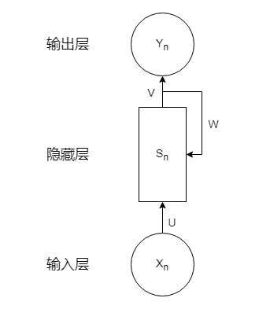

# 循环神经网络
## 模型结构
循环神经网络(Recurrent Neural Network)是一种运算单元被循环使用的神经网络，专门用来处理时间序列问题，能够提取时间序列信息。循环神经网络与传统的前馈神经网络有所不同，循环神经网络隐藏层相互连接，即一个序列当前的输出与前面的输出也有关。循环神经网络会对于每一个时刻的输入结合当前模型状态给出一个输出。

符号说明：
* X是输入层的值
* S是隐藏层的值
* U是输入层到隐藏层的权重矩阵
* Y表示输出层的值
* V是隐藏层到输出层的权重矩阵

循环神经网络的输出不仅取决于这次的输入x，还取决于上一次的隐藏层s。由循环神经网络的结构特征很容易看出它擅长解决的问题是与时间序列相关的。RNN已在实践中被证明对NLP是非常成功的。